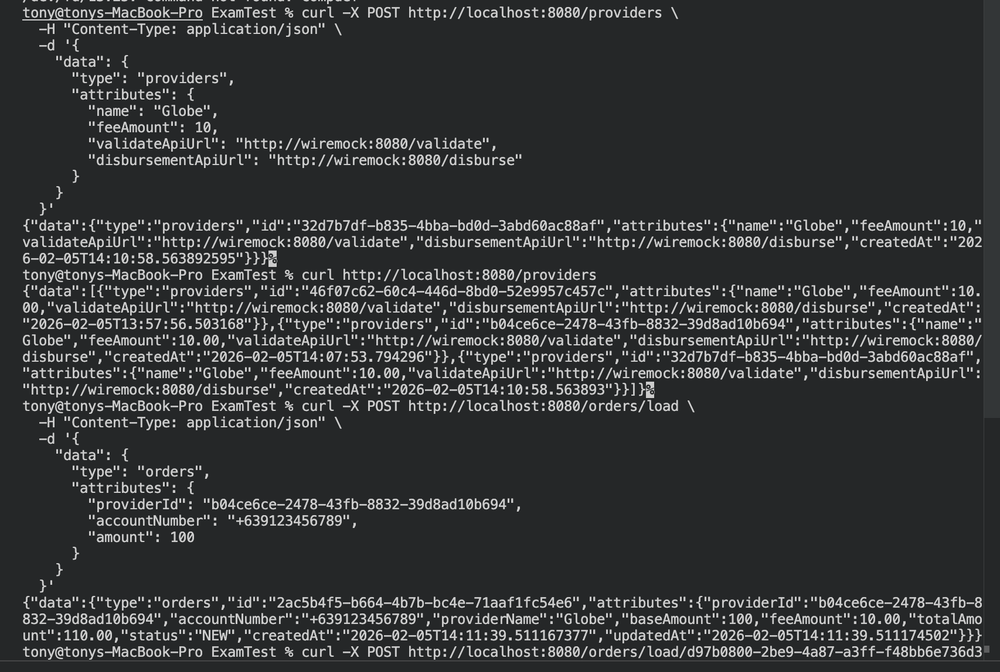
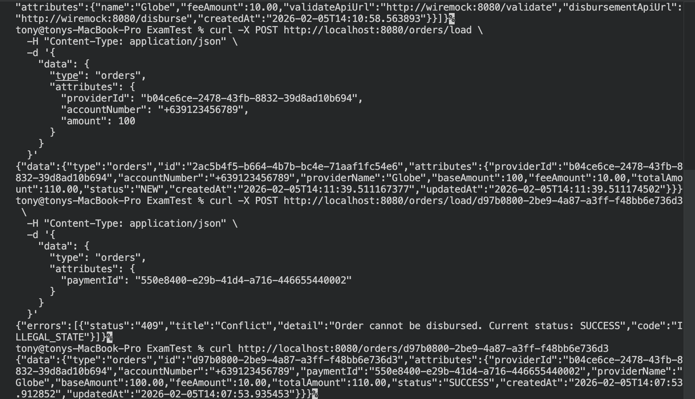

# Load Disbursement Service

A REST service for prepaid mobile load purchasing built with Spring Boot.

## Tech Stack

- Java 21
- Spring Boot 3.4.2
- Spring Data JPA
- PostgreSQL
- Flyway (database migrations)
- WebFlux (WebClient for HTTP calls)
- Lombok
- WireMock (for mocking external services)
- Docker & Docker Compose

## Project Structure

```
Load_Disbursement_Service/
├── src/
│   ├── main/java/com/example/disbursement/
│   │   ├── controller/      # REST controllers
│   │   ├── service/         # Business logic
│   │   ├── repository/      # Data access layer
│   │   ├── entity/          # JPA entities
│   │   ├── dto/             # Data transfer objects
│   │   └── config/          # Configuration classes
│   └── test/                # Unit tests
├── wiremock/                # WireMock stubs
├── docker-compose.yml
├── Dockerfile
└── pom.xml
```

## API Endpoints

### Orders
| Method | Endpoint | Description |
|--------|----------|-------------|
| POST | `/orders/load` | Create a new load order |
| POST | `/orders/load/{orderId}` | Disburse an existing order |
| GET | `/orders/{orderId}` | Get order by ID |

### Providers
| Method | Endpoint | Description |
|--------|----------|-------------|
| POST | `/providers` | Create a new provider |
| GET | `/providers` | Get all providers |

**Content-Type:** `application/vnd.api+json` or `application/json`

## API Demo

### Creating Provider and Load Order


### Order Disbursement and Status Check


## Getting Started

### Prerequisites

- Java 21
- Maven
- Docker & Docker Compose

### Running with Docker Compose

```bash
docker-compose up --build
```

This starts:
- Application on port `8080`
- PostgreSQL on port `5432`
- WireMock on port `8081`

### Running Locally

```bash
./mvnw spring-boot:run
```

### Running Tests

```bash
./mvnw test
```

## License

Add license information here.
